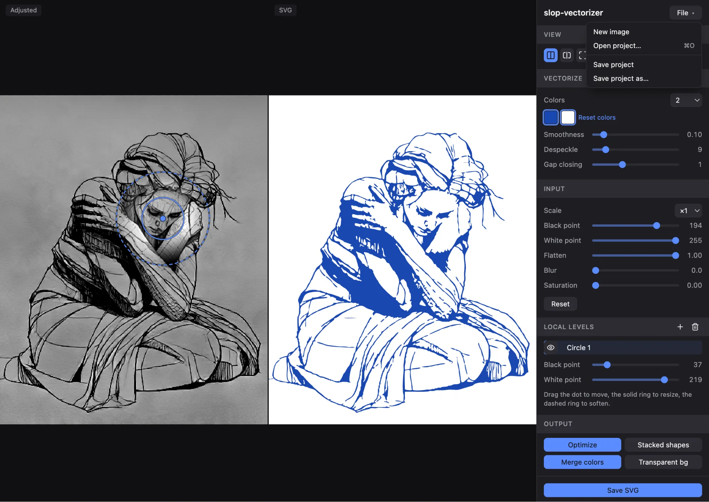

# slop-vectorizer

Client-side image vectorizer with sub-pixel edge recovery, inspired by [Vector Magic](https://vectormagic.com/)'s inverse-rendering approach. Drop a logo, sketch, or flat-art image — get a clean SVG whose curves land where the artwork's edges actually are, not on the pixel grid.

**Live: <https://meigo.github.io/slop-vectorizer/>**

Everything runs in your browser. Images are never uploaded anywhere — the whole pipeline executes locally in a Web Worker.



## How it works

Anti-aliased edge pixels aren't noise — they're measurements. A pixel that's 30% blended between two region colors tells you where the true edge crosses it. The pipeline exploits this:

1. **Pre-effects** — optional levels / blur / saturation cleanup, applied before analysis
2. **Palette estimation** — k-means over flat interior pixels, always from the original-scale image (scale-invariant), with auto color count or manual 2–16
3. **Segmentation** — per-pixel classification, despeckling, and guarded morphological **gap closing** that reconnects dashed thin strokes over textured paper
4. **Sub-pixel boundary tracing** — region boundaries refined against the original anti-aliasing (`t = fa + fb − 0.5`, exact for any edge slope; ~0.04 px measured error)
5. **Corner detection + piecewise cubic Bézier fitting** (Schneider), G1-continuous at smooth joints
6. **SVG assembly** — optional same-color path merging, transparent background, and compact serialization

## Features

- Two synced compare views: side-by-side and overlay-split with draggable divider, deep zoom
- Editable palette: click a swatch to recolor the output; overrides survive scale and pre-effect changes
- Decode-time upscaling ×1–×3 (helps thin strokes; gap-closing range scales with it)
- Light/dark theme, keyboard-accessible controls
- Deterministic: same input + settings → byte-identical SVG

## Development

```bash
npm install
npm run dev            # local dev server
npm run test           # vitest (85 tests, pipeline ground-truth based)
npm run check          # svelte-check + typescript (incl. tests)
npm run lint           # eslint
npm run format         # prettier
npm run build          # production build to dist/
```

The vectorization pipeline (`src/worker/pipeline/`) is pure TypeScript over typed arrays with no DOM dependencies — every stage is unit-tested in Node against analytically-known fixtures (anti-aliased circles must round-trip within 0.1 px, corners must count exactly, output must be byte-deterministic).

## License

[MIT](LICENSE)
